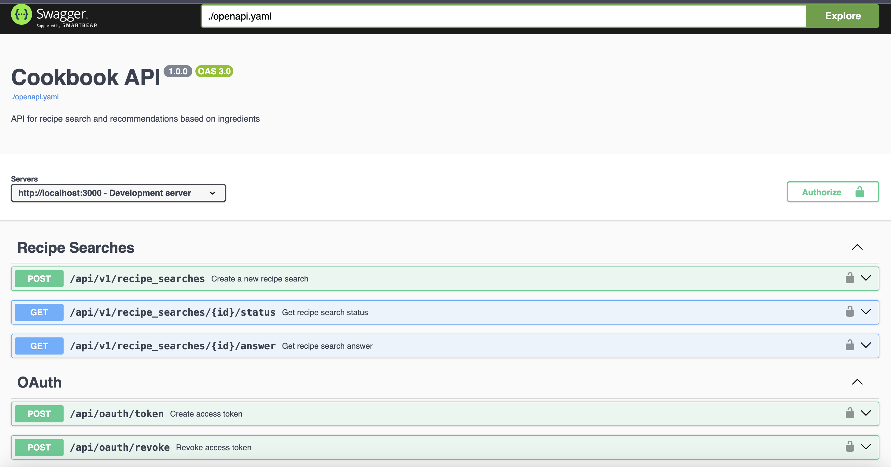

# Cookbook app

A simple app that allows users to get random recipes by providing ingredients.
This app uses the [Groq](https://groq.com/) AI service API on the backend side.

<video width="600" controls>
  <source src="doc/app.mov" type="video/quicktime">
  Your browser does not support the video tag.
</video>

## Introduction

The application consists of 2 parts:
- Backend API built with Rails
  - Please follow instructions from [README.md](api/README.md) to run the backend.
  - The backend application will be available at [http://localhost:3000](http://localhost:3000)
- Frontend app built with React
  - Please follow instructions from [README.md](app/README.md) to run the frontend.
  - The frontend application will be available at [http://localhost:5173](http://localhost:5173)

## Implementation Details

Because Groq's approximate response time is 7 seconds, API calls should be sent asynchronously in the background.
This means the frontend client has to wait for the results and check the status. There are 2 possible ways to implement this:
- Inform frontend about results via WebSockets
- Frontend polls backend to check the recipe search status and fetches the result once it's ready

### API endpoints

I chose the second option, so there are 3 main endpoints on the backend side:
- Create recipe search entity
- Fetch search status (is answer ready, is answer really a recipe, etc.)
- Fetch search answer (recipe) once AI answer is ready and confirmed

More detail you could find in the API documentation here: [doc/api-docs.html](doc/api-docs.html)

### Authentication

Although the application doesn't require user authentication at the moment, API authentication is implemented using Doorkeeper gem since the frontend is a separate application. The API uses application-only OAuth2 flow (client credentials) which is perfect for this scenario because:
- It provides secure communication between frontend and backend
- It's easily scalable if user authentication needs to be added in the future
- Doorkeeper is a robust solution that supports various OAuth2 flows and can be extended with additional features

P.S. API error handling needs to be improved in the future
